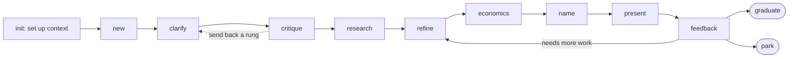

<div align="center">

# boote

**A context-free idea-incubator plugin for [Claude Code](https://docs.claude.com/en/docs/claude-code).**
Pressure-test a raw idea stage by stage like an experienced YC / Techstars mentor — and kill the bad ones early, before you spend real money.

[](https://github.com/hengam-io/boote/actions/workflows/ci.yml)
[](LICENSE)
[](.claude-plugin/plugin.json)
[](https://docs.claude.com/en/docs/claude-code/plugins)

</div>

---

## Why boote

Most early-stage ideas die in the same handful of ways: they target a problem nobody actually has, they hide an untested assumption under a clean deck, or their unit economics collapse the moment you try to make them concrete. boote is a Claude Code plugin that walks an idea through those failure modes the way an experienced (10y+) YC/Techstars mentor would — clarifying questions first, a hard critique next, real grounded research, a defensible financial model, and only then a name, a memo, and a deck. The job is to **build the real idea**, and to **kill bad ideas early**.

The spine is a **7-rung validation ladder** (customer/problem → why-now → value → solution/RAT → business-model → go-to-market → PMF). boote tracks where an idea actually sits, **gates progress on evidence** — an idea with no real user conversations is *raw by definition*, and the honest next step is customer discovery, not a higher score — and, like a good mentor, **sends you backward** the moment a claim outruns its proof.

It is **context-free** in that it ships zero company data — but it is **not context-optional**. A mentor who knows nothing about your strategy, red lines, and opportunity cost can only give generic advice, so boote **discovers and requires** the host project's own context (strategy + hurdle, principles + red lines, risks, learnings) and routes you to a one-time `boote init` when it's missing. The same toolkit works for any company, with nothing hardcoded.

> **«boote»** (Persian for *crucible*) — the vessel an idea is melted down and tested in.

## The lifecycle



It is a **loop, not a line**: `office-hours` re-anchors an idea on its riskiest assumption at any time, and `critique` routinely sends a founder *back* a rung when a claim outruns its evidence.

| stage | what happens |
|---|---|
| `init` | One-time host-context setup; writes `boote.config.md` (strategy + hurdle, principles + red lines, …). boote stays `blocked` until this is done or context-light is opted into. |
| `new` / `clarify` | Turn a raw idea into a living `dossier.md` (with its `validation_stage` + `evidence_level`); ask the 3–5 sharpest questions, rung-1 (customer/problem) first. |
| `critique` | A harsh-but-fair YC / Techstars critique (subagent `boote-critic`): places the idea on the ladder, applies the **evidence gate**, names fatal flaws, the single riskiest assumption, a rubric score, the rung to advance to *or go back to*, and a `continue`/`pivot`/`kill` verdict. |
| `research` | Bundled grounded deep web research (Gemini, cited) for the numbers an idea hangs on. (Grounds the market — does not replace talking to users.) |
| `refine` | Apply the critique + findings into the next version; advance or move back a rung; log *what changed and why*. |
| `economics` | Build the real financial model (subagent `boote-economist`, only once the idea is locked and rungs 1–3 hold): capital, bottom-up revenue, pro-forma, break-even, IRR/NPV/payback, Base/Bear/Bull, sensitivity, the riskiest number, and an economic verdict against *your* hurdle. |
| `name` | 5–7 candidate names + identity + tagline with a light collision check (subagent `boote-namer`). |
| `present` | A one-page memo and a self-contained interactive HTML deck, tuned to the audience. |
| `office-hours` | The recurring re-anchor: the one most important thing · what users *did* · the riskiest assumption + this week's test · default alive? |
| `feedback` → `graduate` / `park` | Log external feedback and what it taught. Graduate to your own decision tooling, or park with a post-mortem. |

Everything is bundled: critique, deep research, economics, naming, memo + deck output. The only external dependency is a Gemini API key for `research`.

## Standalone Gemini research (paid) — `/boote:gemini-research-paid`

The paid research engine boote uses for `boote research` is also exposed as its **own standalone skill**, **`/boote:gemini-research-paid`**, so you can research *any* topic on its own — with **no idea-incubation attached**: no dossier, no validation ladder, no host-context gate. It runs the bundled `plan → research → synthesize → cite` loop over Google's **Gemini API** (`generateContent`, billed key, can escalate to a Pro model), writes a cited Markdown report, and gives you a TL;DR with sources.

It is **Gemini-powered and paid** — distinct from Anthropic's built-in `/deep-research` (which fans out Claude's own WebSearch and needs no key). Its **free** counterpart is **`/yar:gemini-research-free`** (the same idea over the Gemini CLI), if you have the **yar** plugin installed.

```text
/boote:gemini-research-paid "EV charging-station unit economics in Western Europe, 2024–2025"
/boote:gemini-research-paid "willingness to pay for adult sports memberships in the GTA"   # add "deep" for a broader pass
```

Reach for it when you want a researched, sourced answer and don't want the mentor pipeline; `boote research` is the same engine *inside* an idea's workspace (it folds findings into the dossier). Same engine, no duplicated code; needs `GEMINI_API_KEY`. The report is raw researched facts, not professional legal/medical/financial advice.

## Customer-discovery interviews — `/boote:discovery`

The evidence gate keeps saying the same thing: *go talk to users.* **`/boote:discovery`** is the skill that makes those conversations count. From an idea's dossier it generates a ready-to-run, **Mom Test-disciplined interview kit** — screener, 60-second opening + consent, a JTBD-style timeline reconstruction of the last real episode, non-leading probes mapped to each pain hypothesis (each with "the signal we listen for" and "what would disprove it"), workaround-and-cost digging, a commitment ladder (time / reputation / money), a snowball close, and a debrief form — written in the language the interviews will actually run in. After each conversation, **`debrief`** turns raw notes into a structured evidence file (facts, verbatim quotes, pain signals, commitments — interpretation kept separate) and updates the dossier's `evidence_level` honestly; **`synth`** finds patterns across three or more interviews and proposes what they mean for the riskiest assumption.

```text
/boote:discovery                            # interview kit for the active idea (or it asks which)
/boote:discovery my-idea                    # kit for a specific idea by slug
"I talked to a buyer yesterday — log it"    # debrief mode
"synthesize my interviews"                  # synth mode
```

Grounded in a sourced methodology bundled with the skill: The Mom Test, YC's "How to Talk to Users", Steve Blank's customer discovery, Lean Customer Development, Deploy Empathy, and JTBD switch interviews. It never pitches the idea in a discovery interview, never counts praise as evidence, and never bumps the dossier version — judgment stays with `boote critique`.

## Replying to the person who gave you the idea

Often the idea came from *someone* — an employee, a friend, a founder who pitched you — and once you've pressure-tested it you owe them an answer. **`/reply`** is a **separate skill** that drafts that email the way a YC/Techstars mentor would actually say it: direct, specific, sourced, and human — no flattery, no fake warmth, no vague "maybe later." It reads the idea's critique and research and writes one of two emails, auto-detected from the verdict and confirmed with you:

- **`iterate`** — your honest read plus the *one concrete thing to go prove next*, and an invitation to come back with it. The door stays open.
- **`pass`** — a clean no, with the specific reason (framed as fixable where it honestly is) and, at most, one *objective* milestone that would make you look again. No false hope.

Every flaw or finding cites its **exact source** — the original links pulled from the idea's research — so the person can check it or act on it. The draft strips all boote jargon, honors your house `voice` and redaction, and is written in the recipient's language. It produces a **draft for you to send — it never sends.**

```text
/reply                          # pick the idea (or it asks), confirm the mode, review the draft
/reply pickleball-academy       # target a specific idea by slug
/reply pickleball-academy pass  # force the pass email (else it detects the mode from the verdict)
```

## Distilling an idea (and erasing its trail)

boote never deletes history — but sometimes you want the opposite: one clean, shareable write-up of an idea with no incubation trail behind it. **`/distill`** is a **separate, manual-only** command for exactly that. It takes the latest version of an idea, rewrites it **in the founder's own voice** as a single self-contained `idea.md` (ready to hand around for outside opinions, or to re-seed into a fresh `boote new`), then **permanently deletes everything else in that idea's folder** — the dossier, rounds, research, economics, presentations, and feedback log.

It is **destructive and irreversible**, so it is fenced off in its own skill: it is never auto-invoked, it writes and shows the brief *before* touching anything, and it deletes only after you confirm by typing the idea's slug. There is no backup — leaving no trace is the point.

```text
/distill                       # pick the idea (or it asks which), review the brief, confirm
/distill pickleball-academy    # target a specific idea by slug
```

## Install

Inside Claude Code:

```text
/plugin marketplace add hengam-io/boote
/plugin install boote
```

To develop against a local checkout instead, point the marketplace at the directory:

```bash
git clone https://github.com/hengam-io/boote.git boote
```

```text
/plugin marketplace add ./boote
/plugin install boote
```

For deep research, set a Gemini API key in your project's `.claude/settings.local.json` env block (it's gitignored by Claude Code) as `GEMINI_API_KEY`.

## Quickstart

In any project, talk to boote naturally. The first run sets up context:

```text
boote init                       # one-time: capture strategy + hurdle, principles + red lines
boote new "A subscription pickleball academy for adults 35+ in Toronto."
boote critique
boote research "willingness to pay for adult sports memberships in GTA"
boote refine
boote office-hours               # re-anchor on the riskiest assumption any time
boote economics
boote name
boote present board
```

Each command writes to `<workspace>/<slug>/` (default `boote/<slug>/`). The
living source of an idea is its `dossier.md`; rounds, research, economics, and
presentations are append-only snapshots that link back to it.

You can also trigger it conversationally — *"cook this idea"*, *"pressure-test
my idea"*, *"critique this"* — boote's skill is invoked automatically.

## How it uses your project's context

At the start of every run boote resolves eight **context slots** and checks a **gate**:

1. **Explicit config.** A `boote.config.md` at your repo root mapping each slot to a file (copy [`boote.config.example.md`](boote.config.example.md), or run `boote init` to write it interactively). Preferred and predictable.
2. **Auto-discover.** For any unset slot, boote scans for conventional files (`CLAUDE.md`, `**/strategy*`, `**/vision|values|principles*`, `**/risk*`, an existing `boote/` dir) and tells you what it found.
3. **The gate.** If the required slots — `strategy` (incl. a hurdle rate) and `principles` (your red lines) — are present → **resolved**, proceed. If not, boote is **blocked** and routes you to `boote init`; it will not critique, model, or present without them. Running on pure methodology is still possible, but only as an **explicit, announced opt-in** (`mode: context-light`) — never a silent default.

| slot | what it feeds | typical host file |
|---|---|---|
| `strategy` | portfolio fit and the opportunity-cost hurdle | a strategy doc |
| `principles` | values and red lines an idea is checked against | a values/principles doc |
| `risks` | the company risk register an idea may touch | a risk register |
| `learnings` | append-only cross-idea lessons | `<workspace>/_learnings.md` |
| `workspace` | where idea folders live | `boote/` |
| `output_style` | house style for owner-facing output | a reporting-style doc |
| `voice` | founder voice for text written on the owner's behalf | a voice/tone doc |
| `research_key` | Gemini key for bundled deep research | env `GEMINI_API_KEY` |

Run `bash scripts/discover-context.sh .` in any project to see the manifest.
Full model: [`skills/boote/references/context-discovery.md`](skills/boote/references/context-discovery.md).

The **mentor brain is generic** and ships in the plugin (YC Startup School + office hours, Techstars Mentor Manifesto, the Mom Test / JTBD / RAT / Lean / Sequoia). Only the company-specific *framing* is discovered — never baked in.

## What's in the box

```
.claude-plugin/
  plugin.json            plugin manifest
  marketplace.json       marketplace manifest

skills/boote/
  SKILL.md               the orchestrator — sub-commands and routing
  references/            progressive-disclosure knowledge base:
    methodology.md          mentor brain (the validation ladder + frameworks)
    critique-rubric.md      checklist, evidence gate, 100-point scoring
    dossier-template.md     the required dossier schema (stage + evidence)
    economics-methodology.md modeling principles (the 10)
    financial-model-template.md the model template the economist fills
    intake-questions.md     the clarification bank
    memo-template.md        one-page memo
    deck-template.html      self-contained interactive deck
    context-discovery.md    the context-slot model

skills/distill/
  SKILL.md               separate, manual-only: collapse an idea to one brief, erase history
  references/
    founder-brief-template.md  the founder-voice brief distill leaves behind

skills/reply/
  SKILL.md               separate: draft the pass / iterate email back to the idea's owner
  references/
    reply-methodology.md   how to write it (two modes, sourcing discipline, tone, anti-patterns)
    reply-templates.md     the iterate and pass email skeletons

skills/gemini-research-paid/
  SKILL.md               separate, standalone: paid Gemini research on ANY topic (also the engine behind `boote research`)

skills/discovery/
  SKILL.md               separate: interview kits + evidence logging + synthesis for customer discovery
  references/
    interview-methodology.md  the sourced interviewing brain (Mom Test, YC, Blank, Alvarez, Hansen, JTBD, bias traps)
    kit-template.md           the kit / evidence-file / synthesis skeletons

agents/
  boote-critic.md        harsh-but-fair YC/Techstars critique
  boote-economist.md     bottom-up financial model + economic verdict
  boote-namer.md         5–7 candidate names + identity + collision check

scripts/
  discover-context.sh    resolves host-context slots
  deep-research.sh       Gemini grounded research entry point
  research_engine.py     plan → research → synthesize → write

boote.config.example.md  copy to your repo root and point at YOUR files
```

## Subagents

| Agent | Role |
|---|---|
| [`boote-critic`](agents/boote-critic.md) | Harsh-but-fair critique. Places the idea on the validation ladder, applies the evidence gate, restates the thesis, names fatal flaws and hidden assumptions, picks the single riskiest assumption to test next, scores against a five-dimension rubric, names the rung to advance to *or go back to*, and gives a `continue`/`pivot`/`kill` verdict with confidence. |
| [`boote-economist`](agents/boote-economist.md) | Bottom-up financial model: unit economics, capital stack, pro-forma, returns (payback/IRR/NPV), Base/Bear/Bull, sensitivity, the riskiest number, and an economic verdict against your hurdle. |
| [`boote-namer`](agents/boote-namer.md) | 5–7 candidates with rationale, positioning, and taglines, plus a light web collision check. |

## How the research engine works

`boote research "..."` and the standalone `/boote:gemini-research-paid` skill share one small agentic loop, all over Gemini's grounded `generateContent` (no third-party Python dependencies):

1. **Plan** — decompose the question into focused, search-friendly sub-questions (4 fast / 8 deep).
2. **Research** — one grounded web-search call per sub-question (concurrent, retried).
3. **Synthesize** — combine the findings into a structured, cited English report.
4. **Write** — `research/<...>.md` with an `EXECUTIVE_SUMMARY` marker, the full report, and a deduped Sources list.

The skill then writes a one-page executive summary into the marker and folds the key findings into the dossier with source + date.

> The earlier engine used Gemini's background Deep-Research API, which (with this project's key) accepted jobs but never executed them. The synchronous grounded path was rebuilt 2026-06-01 and is what ships today.

## Documentation

- **[`SKILL.md`](skills/boote/SKILL.md)** — the orchestrator; describes every sub-command.
- **[`references/methodology.md`](skills/boote/references/methodology.md)** — the mentor brain (the validation ladder, the iteration loops, the frameworks).
- **[`references/critique-rubric.md`](skills/boote/references/critique-rubric.md)** — the critique checklist, the evidence gate, and scoring.
- **[`references/dossier-template.md`](skills/boote/references/dossier-template.md)** — the required dossier schema (stage + evidence + blocking fields).
- **[`references/economics-methodology.md`](skills/boote/references/economics-methodology.md)** — the 10 modeling principles and traps.
- **[`references/financial-model-template.md`](skills/boote/references/financial-model-template.md)** — the model template.
- **[`references/context-discovery.md`](skills/boote/references/context-discovery.md)** — how host context is resolved.

## Security and privacy

- **No telemetry.** The only network calls boote makes are the deep-research runs you explicitly invoke (to Google's Generative Language API).
- **PII-clean queries.** The skill is instructed to strip personal and confidential information from any research query.
- **Mandatory redaction.** Memos and decks pass through a redaction step against your host's `output_style` before they are produced.
- **No secrets in the repo.** `GEMINI_API_KEY` lives in the gitignored `.claude/settings.local.json`.

See [`SECURITY.md`](SECURITY.md) for vulnerability reporting.

## Project status

This is **v2.2.0** — the v2.0.0 methodology and structure overhaul (the validation ladder, the evidence gate, required host context via `boote init`), the standalone `gemini-research-paid` skill, and the `discovery` customer-interview skill (kits, evidence logging, synthesis). It is solo-maintained and used in production by its author. **Breaking vs v1.0.0:** a project with no host context is now `blocked` until `boote init` runs (or context-light is opted into explicitly). The surface area (sub-commands, reference files, agents) is otherwise stable and won't change in a breaking way without a major-version bump. Track changes in [`CHANGELOG.md`](CHANGELOG.md).

## Contributing

Contributions are welcome. See [`CONTRIBUTING.md`](CONTRIBUTING.md) for setup,
the validation commands CI runs, and conventions; [`CODE_OF_CONDUCT.md`](CODE_OF_CONDUCT.md)
for community standards.

## License

[MIT](LICENSE) © Ali Rajool. Part of the same toolkit family as [`yar`](https://github.com/rajool/yar).
